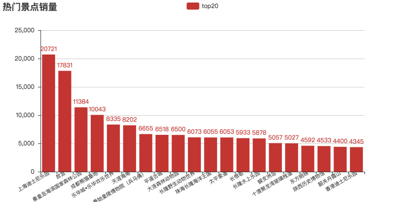
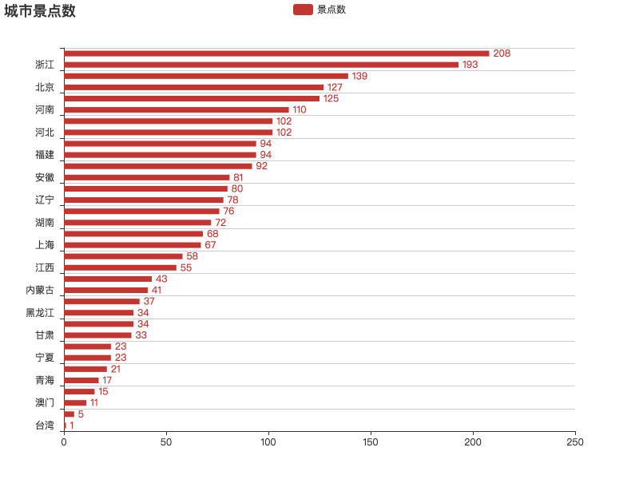

# python_qunar_spider

## 爬取去哪网全国旅游信息
通过分析去哪网发现，页面显示是通过ajax请求api返回json数据，所以不用通过去解析html页面，直接获取到json数据，
得到相应的数据，然后参照百度热力图提供的模板，创建热力图的html文件即可。

获取数据的接口在150多页的时候，数据就开始重复了，真实数据并没有接口返回的totalcount这么多

## 数据处理
读取保存excel表中数据，进行相应的数据处理
然后通过pyecharts模块，生成图表
pyecharts参考中文文档地址http://pyecharts.org/#/zh-cn/prepare

### 排名前20景点

### 城市景点数

